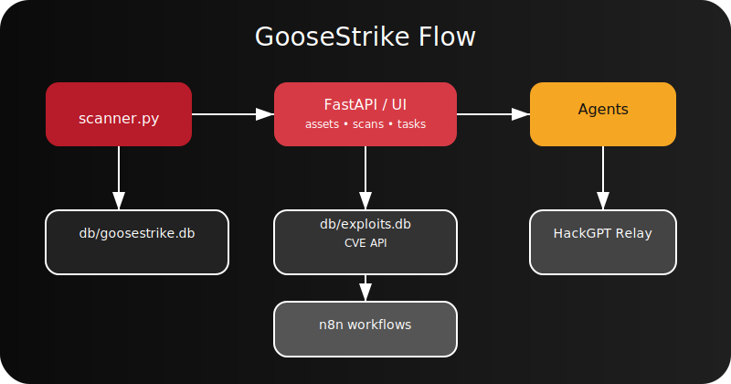

# GooseStrike

GooseStrike is an AI-assisted, Canadian-themed offensive security and CTF operations toolkit. It blends subnet discovery, CVE/exploit correlation, task orchestration, and agent-driven planning into one cohesive platform designed **only** for authorized lab environments.

## Features

- **Scanner** – wraps `nmap`, preserves MAC/OUI data, captures timestamps/notes, and automatically ingests results with a scan UUID for replay-grade history.
- **Indexer** – parses NVD + Exploit-DB + PacketStorm data into `db/exploits.db`, ensuring CVEs, severities, and exploit metadata always live in SQLite for offline ops.
- **FastAPI backend** – tracks assets, services, CVEs, scan runs, MITRE ATT&CK suggestions, and alerts while exposing webhook hooks for n8n automations.
- **Task queue + runners** – enqueue work for Metasploit, SQLMap, Hydra, OWASP ZAP, the password cracking helper, and now manage every job directly from the dashboard.
- **Password cracking automation** – orchestrate Hashcat, John the Ripper, or rainbow-table (`rcrack`) jobs with consistent logging.
- **LLM agents** – structured recon / CVE / exploit / privilege escalation / planning agents for high-level guidance.
- **Claude + HackGPT + Ollama fallback** – the LLM router cycles through Claude, HackGPT, then your local Ollama node so targeting recommendations keep flowing even offline.
- **Local CVE API server** – a standalone FastAPI microservice (`cve_api.py`) serves CVE + exploit matches for air-gapped use.
- **Web UI** – Canadian-themed dashboard that now shows assets, scan history, MITRE recommendations, the task queue, and inline forms to submit tool runs or password-cracking jobs inspired by OWASP Nettacker & Exploitivator playbooks.
- **Roadmap + mock data** – `/core_snapshot`, `/roadmap`, and `/mock/dashboard-data` feed both the live UI and a static mock dashboard so you can preview GooseStrike with fake sample data (served at `/mockup`).
- **Armitage-style frontend** – `/armitage` renders a radial host/service/CVE graph with mock or live data for briefing-style screenshots.
- **Integration health checks** – `/integrations/test/n8n` and `/integrations/test/ollama` verify automation + AI endpoints from the backend without leaving the UI.

## Delivery status

The table below summarizes what has landed versus what remains from the running request list.

| Area | Status | Notes |
| --- | --- | --- |
| Core scanner + history | ✅ Complete | CIDR scanning with MAC/OUI capture, scan UUIDs, and `/scans` history APIs are live.
| CVE / exploit indexer | ✅ Complete | `indexer.py` hydrates `db/exploits.db` from NVD, Exploit-DB, and PacketStorm mirrors.
| FastAPI backend + web UI | ✅ Complete | Canadian-themed dashboard, `/assets`, `/roadmap`, `/mock/dashboard-data`, `/mockup`, webhook, and task endpoints shipped.
| Task queue + tool runners | ✅ Complete | SQLite-backed queue plus Metasploit, SQLMap, Hydra, ZAP, and password-cracking runners.
| MITRE/ATT&CK suggestions | ✅ Complete | `mitre_mapping.py` drives `/attack_suggestions` and the UI cards.
| Password cracking helper | ✅ Complete | `password_cracker_runner.py` supports Hashcat, John, and rainbow tables with log capture.
| Mock dashboard data | ✅ Complete | `GET /mock/dashboard-data` and `/mockup` render the full interface with sample data for demos.
| Roadmap + core snapshot APIs | ✅ Complete | `/core_snapshot` + `/roadmap` expose the same copy used in the UI.
| docker-compose goosestrike full stack | ✅ Complete | `docker-compose.goosestrike-full.yml` now launches API, scanner, indexer, CVE API, HackGPT relay, and n8n together.
| HackGPT API container | ✅ Complete | `hackgpt_api.py` relays prompts to n8n webhooks and ships as its own container.
| Local CVE API server | ✅ Complete | `cve_api.py` exposes the offline CVE mirror over FastAPI/uvicorn.
| Claude + HackGPT fallback system | ✅ Complete | `app/agents/llm_router.py` automatically fails over between providers.
| n8n workflow `.json` import | ✅ Complete | `/n8n/workflows/import` persists exports and `/n8n/workflows` lists them.
| Target prioritizer AI agent | ✅ Complete | `app/agents/prioritizer_agent.py` powers the `/agents/prioritize` endpoint.
| SVG architecture diagram | ✅ Complete | `web/static/architecture.svg` is linked below.
| Armitage-style dashboard view | ✅ Complete | `/armitage` renders the radial host/service/CVE graph with live data.
| Mythic/Sliver C2 bridge | 🔸 Optional | C2 integration untouched pending scoping.

## GooseStrike Core snapshot

| Highlight | Details |
| --- | --- |
| 🔧 Stack | Nmap, Metasploit, SQLMap, Hydra, OWASP ZAP (all wired into runners) |
| 🧠 AI-ready | External LLM exploit assistant hooks for Claude / HackGPT / Ollama |
| 📚 Offline CVE mirroring | `update_cve.sh` keeps the SQLite CVE/exploit mirror fresh when air-gapped |
| 🗂 Branding kit | ASCII banner, official crest, and PDF-ready branding pack for your ops briefings |
| 📜 CVE helpers | Scan-to-CVE JSON matching scripts pulled from Nettacker / Exploitivator inspirations |
| 📦 Artifact drops | `goosestrike-cve-enabled.zip` & `hackgpt-ai-stack.zip` ship with READMEs + architecture notes |

### Coming next (roadmap you requested)

| Task | Status |
| --- | --- |
| 🐳 Build `docker-compose.goosestrike-full.yml` | ✅ Complete |
| 🧠 HackGPT API container (linked to n8n) | ✅ Complete |
| 🌐 Local CVE API server | ✅ Complete |
| 🧬 Claude + HackGPT fallback system | ✅ Complete |
| 🔄 n8n workflow `.json` import | ✅ Complete |
| 🎯 Target "prioritizer" AI agent | ✅ Complete |
| 🧭 SVG architecture diagram | ✅ Complete |
| 🖥 Dashboard frontend (Armitage-style) | ✅ Complete |
| 🔐 C2 bridging to Mythic/Sliver | Optional |

You can query the same table programmatically at `GET /roadmap` or fetch the bullet list at `GET /core_snapshot`.

## Architecture Overview



```
scanner.py -> /ingest/scan ---->
                              FastAPI (api.py) ---> db/goosestrike.db
                                                     |  ├─ assets / services / service_cves
                                                     |  ├─ scan_runs + scan_services (historical state)
                                                     |  └─ attack_suggestions + alerts
indexer.py -> db/exploits.db --/                    |
                                                  REST/JSON + Web UI (assets, scans, MITRE)
                                                    |
                    +-> task_queue.py -> runners (metasploit/sqlmap/hydra/zap) -> logs/
                    +-> app/agents/*  (LLM guidance)
                    +-> n8n webhooks (/webhook/n8n/*)
```

## Quickstart

1. **Clone & install dependencies**
   ```bash
   git clone <repo>
   cd GooseStrike
   pip install -r requirements.txt  # create your own env if desired
   ```

2. **Run the API + UI**
   ```bash
   uvicorn api:app --reload
   ```
   Visit http://localhost:8000/ for the themed dashboard.

3. **Index CVEs & exploits (required for CVE severity + MITRE context)**
   ```bash
   python indexer.py --nvd data/nvd --exploitdb data/exploitdb --packetstorm data/packetstorm.xml
   ```

4. **Scan a subnet**
   ```bash
   python scanner.py 192.168.1.0/24 --fast --api http://localhost:8000 --notes "Lab validation"
   ```
   Every run stores MAC/OUI data, timestamps, the CLI metadata, and the raw payload so `/scans` keeps a tamper-evident trail.

5. **Enqueue tool runs**
   ```bash
   python task_queue.py enqueue sqlmap "http://example" '{"level": 2}'
   ```
   Then invoke the appropriate runner (e.g., `python sqlmap_runner.py`) inside your own automation glue.

6. **Crack passwords (hashcat / John / rainbow tables)**
   ```bash
   python task_queue.py enqueue password_cracker hashes '{"crack_tool": "hashcat", "hash_file": "hashes.txt", "wordlist": "/wordlists/rockyou.txt", "mode": 0}'
   python password_cracker_runner.py
   ```
   Adjust the JSON for `crack_tool` (`hashcat`, `john`, or `rainbow`) plus specific options like masks, rules, or rainbow-table paths. Prefer the dashboard forms if you want to queue these jobs without hand-writing JSON.

## Customizing the dashboard logo

Drop the exact artwork you want to display into `web/static/uploads/` (PNG/SVG/JPG/WebP). The UI auto-loads the first supported file it finds at startup, so the logo you uploaded appears at the top-right of the header instead of the default crest. If you need to host the logo elsewhere, set `GOOSESTRIKE_LOGO` to a reachable URL (or another `/static/...` path) before launching `uvicorn`.

## API Examples

- **Ingest a host**
  ```bash
  curl -X POST http://localhost:8000/ingest/scan \
       -H 'Content-Type: application/json' \
       -d '{
            "ip": "10.0.0.5",
            "mac_address": "00:11:22:33:44:55",
            "mac_vendor": "Acme Labs",
            "scan": {"scan_id": "demo-001", "scanner": "GooseStrike", "mode": "fast"},
            "services": [
              {"port": 80, "proto": "tcp", "product": "nginx", "version": "1.23", "cves": ["CVE-2023-12345"]}
            ]
          }'
  ```

- **List assets**
  ```bash
  curl http://localhost:8000/assets
  ```

- **Get CVE + exploit context**
  ```bash
  curl http://localhost:8000/cve/CVE-2023-12345
  ```

- **Review scan history + MITRE suggestions**
  ```bash
  curl http://localhost:8000/scans
  curl http://localhost:8000/attack_suggestions
  ```

- **Roadmap + mock data**
  ```bash
  curl http://localhost:8000/core_snapshot
  curl http://localhost:8000/roadmap
  curl http://localhost:8000/mock/dashboard-data
  ```
  Preview the populated UI without touching production data at http://localhost:8000/mockup .

- **Import + list n8n workflows**
  ```bash
  curl -X POST http://localhost:8000/n8n/workflows/import \
       -H 'Content-Type: application/json' \
       -d '{"name": "drop-scan", "workflow": {"nodes": ["scan", "notify"]}}'
  curl http://localhost:8000/n8n/workflows
  ```

- **Queue & review tasks**
  ```bash
  curl -X POST http://localhost:8000/tasks \
       -H 'Content-Type: application/json' \
       -d '{
             "tool": "password_cracker",
             "target": "lab-hash",
             "params": {"crack_tool": "hashcat", "hash_file": "hashes.txt", "wordlist": "rockyou.txt"}
           }'
  curl http://localhost:8000/tasks
  ```
  Workers can update entries through `POST /tasks/{task_id}/status` once a run completes.

- **n8n webhook**
  ```bash
  curl -X POST http://localhost:8000/webhook/n8n/new_cve \
       -H 'Content-Type: application/json' \
       -d '{"cve_id": "CVE-2023-12345", "critical": true}'
  ```

- **Armitage data + prioritizer agent**
  ```bash
  curl http://localhost:8000/armitage/data
  curl -X POST http://localhost:8000/agents/prioritize \
       -H 'Content-Type: application/json' \
       -d '{"assets": [{"ip": "10.0.0.21", "services": []}]}'
  ```

## Full-stack Docker Compose

Bring everything (API, scanner, indexer, HackGPT relay, CVE API, and n8n) up in one go:

```bash
docker compose -f docker-compose.goosestrike-full.yml build
docker compose -f docker-compose.goosestrike-full.yml up -d api hackgpt cve-api n8n
# open http://localhost:8000 for the UI and http://localhost:8500/prompt for the HackGPT relay
```

Use `docker compose ... run --rm scanner python scanner.py ...` or `... run --rm indexer python indexer.py` to execute jobs from dedicated containers.

## HackGPT relay + Claude / HackGPT / Ollama fallback

- `hackgpt_api.py` exposes `POST /prompt` (default on port 8500) and forwards every call to `N8N_WEBHOOK_URL` so your automation workflows can react instantly.
- Set any combination of `CLAUDE_API_URL`, `HACKGPT_API_URL`, and `OLLAMA_BASE_URL`/`OLLAMA_API_URL` (with optional `CLAUDE_API_KEY`, `HACKGPT_API_KEY`, and `OLLAMA_MODEL`). The router in `app/agents/llm_router.py` will try Claude first, then HackGPT, and finally fall back to the local Ollama instance.
- The new `/integrations/test/ollama` route helps you confirm GooseStrike can reach your Ollama node before relying on it for agent prompts.

## Local CVE API server

Run `uvicorn cve_api:app --host 0.0.0.0 --port 8600` (or use the compose file) to offer offline CVE lookups:

```bash
curl http://localhost:8600/cve/CVE-2023-12345
curl "http://localhost:8600/search?q=openssl"
```

The service reads the same `db/exploits.db` populated by `indexer.py`.

## Armitage-style dashboard + mock graph

- Browse `http://localhost:8000/armitage` for the live radial graph.
- `GET /armitage/data` returns the same JSON used by the view, while `GET /mock/armitage-data` exposes the sample payload for demos.

## Target prioritizer agent

Send any subset of `AssetOut` structures to `POST /agents/prioritize` to receive ranked notes backed by the LLM fallback path. Use it in tandem with the MITRE cards to plan next actions.

## Password cracking runner

`password_cracker_runner.py` centralizes cracking workflows:

- **Hashcat** – supply `hash_file`, `wordlist` or `mask`, and optional `mode`, `attack_mode`, `rules`, `workload`, or arbitrary `extra_args`.
- **John the Ripper** – provide `hash_file` plus switches like `wordlist`, `format`, `rules`, `incremental`, or `potfile`.
- **Rainbow tables** – call `rcrack` by specifying `tables_path` along with either `hash_value` or `hash_file` and optional thread counts.

All runs land in `logs/` with timestamped records so you can prove what was attempted during an engagement.

## Kali Linux Docker stack

Need everything preloaded inside Kali? Use the included `Dockerfile.kali` and `docker-compose.kali.yml`:

```bash
docker compose -f docker-compose.kali.yml build
docker compose -f docker-compose.kali.yml up -d api
# run scanners or runners inside dedicated containers
docker compose -f docker-compose.kali.yml run --rm scanner python scanner.py 10.0.0.0/24 --fast --api http://api:8000
docker compose -f docker-compose.kali.yml run --rm worker python password_cracker_runner.py
```

The image layers the GooseStrike codebase on top of `kalilinux/kali-rolling`, installs `nmap`, `masscan`, `sqlmap`, `hydra`, `metasploit-framework`, `hashcat`, `john`, and `rainbowcrack`, and exposes persistent `db/`, `logs/`, and `data/` volumes so scan history and cracking outputs survive container restarts.

## Extending GooseStrike

- **Add a new runner** by following the `runner_utils.run_subprocess` pattern and placing a `<tool>_runner.py` file that interprets task dictionaries safely.
- **Add more agents** by subclassing `app.agents.base_agent.BaseAgent` and exposing a simple `run(context)` helper similar to the existing agents.
- **Enhance the UI** by editing `web/templates/index.html` + `web/static/styles.css` and creating dedicated JS components that consume `/assets`, `/scans`, and `/attack_suggestions`.
- **Integrate orchestration** tools (n8n, Celery, etc.) by interacting with `task_queue.py` and the FastAPI webhook endpoints.

## Safety & Legal Notice

GooseStrike is intended for **authorized security assessments, CTF competitions, and lab research only**. You are responsible for obtaining written permission before scanning, exploiting, or otherwise interacting with any system. The maintainers provide no warranty, and misuse may be illegal.
- **Test n8n & Ollama integrations**
  ```bash
  curl -X POST http://localhost:8000/integrations/test/n8n \
       -H 'Content-Type: application/json' \
       -d '{"url": "http://n8n.local/webhook/goose", "payload": {"ping": "demo"}}'

  curl -X POST http://localhost:8000/integrations/test/ollama \
       -H 'Content-Type: application/json' \
       -d '{"url": "http://localhost:11434", "model": "llama3", "prompt": "ping"}'
  ```
  Both endpoints accept optional overrides and default to the `N8N_WEBHOOK_TEST_URL`, `OLLAMA_BASE_URL`, and `OLLAMA_MODEL` environment variables so you can store safe defaults in compose files.
